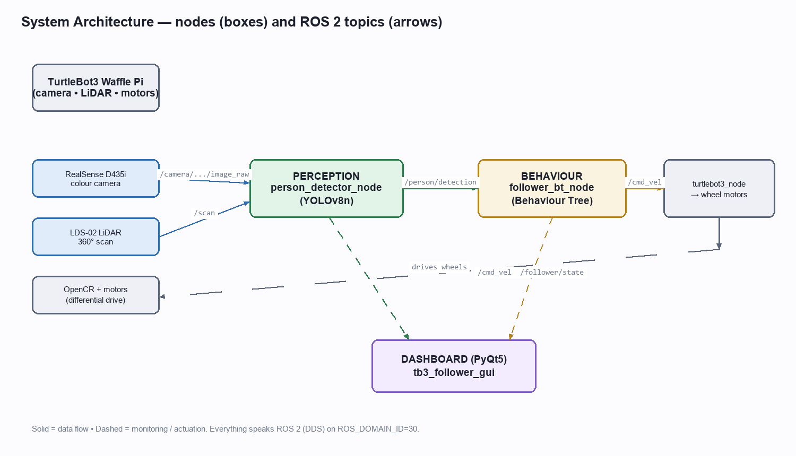
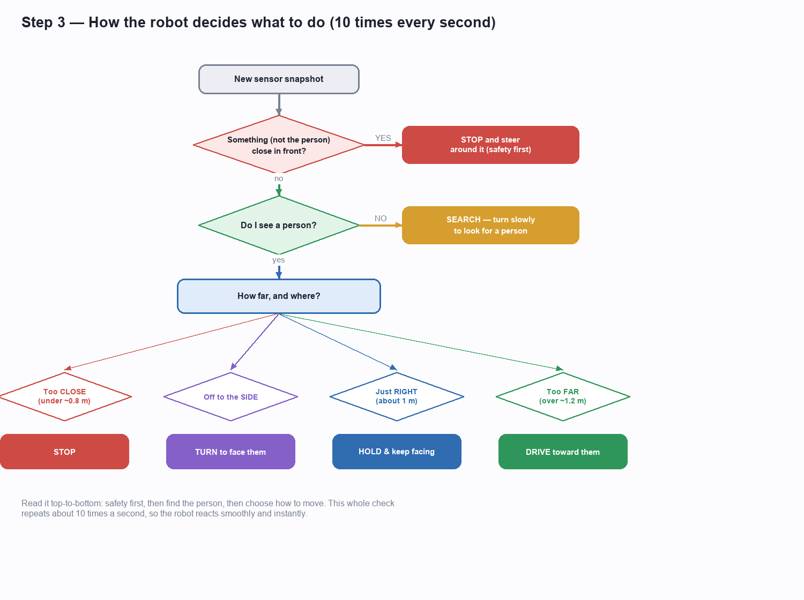
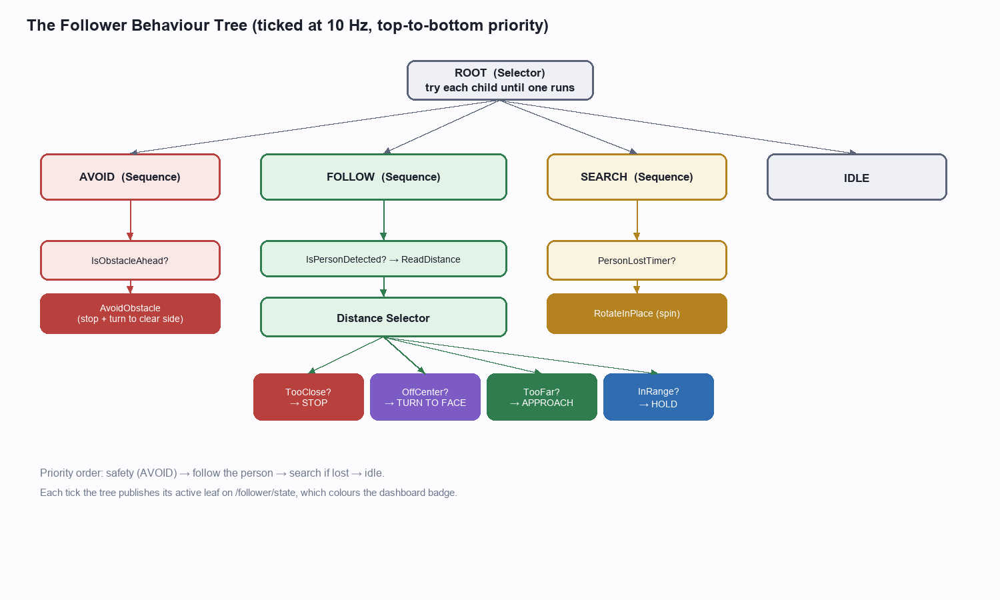
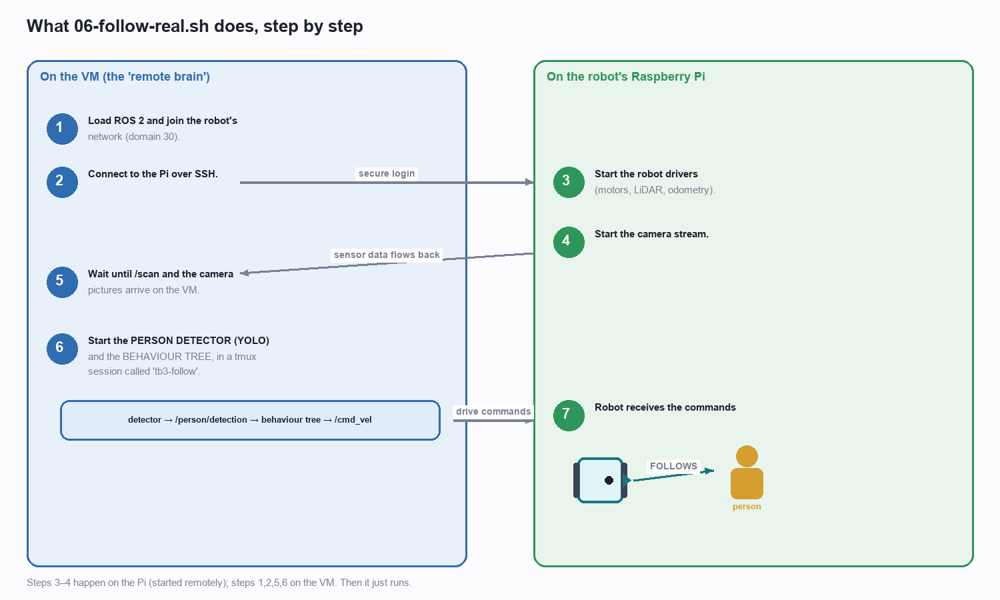

# TurtleBot3 Human-Following Robot 🤖

> An autonomous **person-following robot**: a camera + neural network find the nearest person, a
> **behaviour tree** decides how to move, and the robot drives after them while **avoiding obstacles**
> with its LiDAR. Runs both in **Gazebo simulation** and on a **real TurtleBot3 Waffle Pi**.
>
> **Stack:** ROS 2 Humble · Ultralytics YOLOv8 · py_trees · Intel RealSense D435i · LDS-02 LiDAR · PyQt5 dashboard

<p align="center"></p>

---

## ✨ Features

- **Person detection** with YOLOv8 (filtered to the *person* class).
- **Follow the nearest** person when several are visible.
- **Robust distance** — a pinhole-camera estimate fused with the LiDAR reading.
- **Smooth following** — proportional control: approach when far, hold at ~1 m, stop when too close.
- **Orient-to-face** — rotates in place to centre a person who is off to the side.
- **LiDAR obstacle avoidance** that never mistakes the followed person for an obstacle.
- **Live PyQt5 dashboard** — camera + detection box, colour-coded state, and telemetry.
- **Sim ↔ real** — the identical decision code runs in Gazebo and on the physical robot.

## 🎥 Demo

| Simulation (Gazebo) | Real robot |
|---|---|
| [`docs/media/simulation.mp4`](docs/media/simulation.mp4) | [`docs/media/realTesting.mp4`](docs/media/realTesting.mp4) |

---

## 🏗️ How it works

Three cooperating ROS 2 nodes: **perception** (sees), **behaviour** (decides), and an optional
**dashboard** (watches). Data flows as ROS 2 topics.

**The decision logic** — a behaviour tree ticked 10×/second, read top-to-bottom as priorities:

<p align="center"></p>

<p align="center"></p>

> A full, plain-English explanation with diagrams is in **[docs/](docs/)** — see *Documentation* below.

---

## 📁 Repository structure

```
ros2_ws/src/
  tb3_follower_msgs/         # the PersonDetection message
  tb3_follower_perception/   # YOLO person detector  (person_detector_node.py)
  tb3_follower_behavior/     # behaviour tree         (follower_bt_node.py, tree.py, obstacle.py …)
  tb3_follower_gui/          # PyQt5 dashboard        (dashboard.py)
  tb3_follower_bringup/      # launch files + Gazebo world
scripts/                     # setup + run scripts (00 … 06)
docs/                        # guides, diagrams, demo media
```

---

## 🧩 Requirements

**Real robot:** TurtleBot3 Waffle Pi · Raspberry Pi 4 · OpenCR · Intel RealSense D435i · LDS-02 LiDAR.
**Dev machine:** Ubuntu 22.04 (a VirtualBox VM on Windows works well) with **ROS 2 Humble**.

---

## ⚙️ Installation (one-time setup)

Run these **once**, in order, inside the Ubuntu machine:

```bash
bash scripts/00-bootstrap-vm.sh <sudo-password>   # prepare the VM (passwordless sudo + symlink)
bash scripts/02-install-ros.sh                     # ROS 2 Humble + TurtleBot3 + Gazebo + tmux
bash scripts/03-install-yolo.sh                    # YOLOv8 (ultralytics + CPU torch) + py_trees + model
bash scripts/04-build-workspace.sh                 # colcon build of this project
```

Open a **new terminal** afterwards (or `source ~/.bashrc`) so the ROS 2 environment is loaded.

> Every terminal below assumes ROS 2 + the workspace are sourced:
> ```bash
> source /opt/ros/humble/setup.bash && source ~/ros2_ws/install/setup.bash
> ```

---

## ▶️ How to run — Simulation (no hardware)

One command opens Gazebo + the detector + the behaviour tree in a 3-pane tmux session:

```bash
bash scripts/05-run-demo.sh          # start
tmux kill-session -t tb3-follower    # stop
```

You'll see a 20×20 m room with three walking people; the robot follows the nearest one.
Watch it with `ros2 topic echo /person/detection` and `ros2 topic echo /cmd_vel`.

---

## 🤖 How to run — Real robot

<p align="center"></p>

**The short version — one command starts real-time following:**

```bash
bash scripts/06-follow-real.sh
```

It SSHes to the robot's Pi and starts the drivers + camera (if not already running), waits for the
sensor data, then launches the YOLO detector and the behaviour tree on the dev machine. The robot then
follows the nearest person. Override the Pi password if needed: `PI_PASS=yourpass bash scripts/06-follow-real.sh`.

**Prerequisites:** the robot is powered on and on the same network as the dev machine, and both use the
same `ROS_DOMAIN_ID` (the script forces `30`). See [docs/setup/](docs/setup/) for the networking details.

### Which programs actually run?

`06-follow-real.sh` launches these for you. The two **required** Python nodes are:

| Node | File | Role |
|---|---|---|
| `person_detector_node` | `tb3_follower_perception/…/person_detector_node.py` | **Eyes** — YOLO finds the nearest person |
| `follower_bt_node` | `tb3_follower_behavior/…/follower_bt_node.py` | **Brain** — decides and publishes `/cmd_vel` |

Run them by hand (advanced):

```bash
# 1) detector
ros2 run tb3_follower_perception person_detector_node --ros-args \
  --params-file ~/ros2_ws/src/tb3_follower_perception/config/detector_params.yaml \
  -p image_topic:=/camera/camera/color/image_raw \
  -p camera_info_topic:=/camera/camera/color/camera_info

# 2) behaviour tree (publishes /cmd_vel to the robot)
ros2 launch tb3_follower_bringup behavior.launch.py

# 3) dashboard (optional GUI)
ros2 run tb3_follower_gui dashboard --ros-args -r /camera/image_raw:=/camera/camera/color/image_raw
```

### Watch / stop

```bash
tmux attach -t tb3-follow          # see the panels (detach: Ctrl+B then D)
ros2 topic echo /follower/state    # current action: approaching / holding / avoiding / orienting …
tmux kill-session -t tb3-follow    # stop the follower
sshpass -p turtlebot ssh ubuntu@<pi-ip> "pkill -f robot.launch; pkill -f realsense2_camera_node"
```

> ⚠️ **Safety:** the real robot moves. Give it clear floor space and keep the stop command handy.

---

## 🎛️ Configuration (tuning)

Edit `ros2_ws/src/tb3_follower_behavior/config/follower_params.yaml`, then restart the behaviour node.

| Parameter | Default | Meaning |
|---|---|---|
| `target_distance` | `1.0` m | Gap the robot keeps. |
| `close_threshold` / `far_threshold` | `0.8` / `1.2` m | STOP below / APPROACH above. |
| `max_linear_speed` / `max_angular_speed` | `0.22` / `1.0` | Speed caps. |
| `k_linear` / `k_angular` | `0.4` / `1.5` | Proportional gains. |
| `orient_offset_threshold` | `0.22` | How far off-centre before turning to face. |
| `obstacle_stop_distance` | `0.4` m | Obstacle nearer than this ahead → avoid. |
| `avoid_yaw_rate` | `0.6` | Turn rate while avoiding. |
| `person_lost_timeout` | `2.5` s | How long to keep following through drop-outs before searching. |

---

## 🧪 Tests

The decision maths are pure functions, unit-tested without a robot:

```bash
cd ~/ros2_ws/src/tb3_follower_perception && python3 -m pytest test/ -q
cd ~/ros2_ws/src/tb3_follower_behavior   && python3 -m pytest test/ -q
```

Covers distance/fusion, nearest-person selection, the proportional controller, obstacle detection
(with person-exclusion), and the full behaviour tree (search / approach / hold / stop / orient / avoid).

---

## 📚 Documentation

- **[Visual Guide (PDF)](TurtleBot3_Human_Follower_Visual_Guide.pdf)** — plain-English, no code, how it works (best for understanding).
- **[Scripts Guide (PDF)](TurtleBot3_Follower_Scripts_Guide.pdf)** — the scripts and exactly how to run it.
- **[Technical Tutorial (PDF)](TurtleBot3_Human_Follower_Tutorial.pdf)** — the full detail *with* code.
- Setup walkthroughs in **[docs/setup/](docs/setup/)** and a plain-English explainer in **[docs/HOW_IT_WORKS.md](docs/HOW_IT_WORKS.md)**.

---

## 🛠️ Troubleshooting

| Symptom | Cause | Fix |
|---|---|---|
| VM crashes on start (*"memory could not be read"*) | 8 GB VM on a 16 GB host | Run the VM at **6 GB** (or 4 GB headless). |
| Camera won't stream (`UVC control … timed out`) | Raspberry Pi under-voltage | Powered USB-3 hub / charge battery; `vcgencmd get_throttled` must read `0x0`. |
| Robot & follower can't see each other | Mismatched `ROS_DOMAIN_ID` | Force **30** on both; `ROS_LOCALHOST_ONLY=0`. |
| Detects a person but only rotates | Stale detections over a slow link | Already handled: positive-only latching + 2.5 s timeout. |
| Laggy video over Wi-Fi | 640×480 raw too heavy | Stream **424×240** (the script's default). |

---

## 📄 License

MIT — see [LICENSE](LICENSE).
